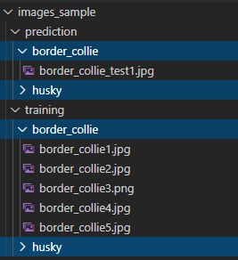

# Azure Custom Vision Benchmark

Automated programs for training and prediction tasks using Azure Custom Vision (Cognitive Services).

## Setup

### Resource

Create the Cognitive Service resource in Azure:

```
az cognitiveservices account create -n <name> -g <group> --kind CognitiveServices --sku S0 -l eastus --yes
```

Go to [customvision.ai](https://www.customvision.ai/projects#/settings) resources and copy the folling parameters:

- `Endpoint`
- `Key`
- `Resource ID`

Add these values to `.env`

### Tags & Image Samples

Add the tags to the `.env` file separeted by commas (`,`)

```
tags=tag1,tag2,tag3
```

The tags must match the directories for the image sets.

Example:



My algorithm is limited to send a single batch of 64 images. Help me with a pull request :grin:


Custom Vision recommends at least 50 images per set to ensure model performance. 
Following the rule of thumb 70/30 you should have at least 15 additional images for the prediction tests.

## Training


Create the `.env` with the required properties.

Use `ts-node` to create the project artifacts:

```
create-project.ts
create-tags.ts
```

## References

Custom Vision Portal: https://www.customvision.ai

[Custom Vision with SDK](https://docs.microsoft.com/en-us/azure/cognitive-services/custom-vision-service/quickstarts/image-classification?pivots=programming-language-javascript)

[Custom Vision Service Limits and Quotas](https://docs.microsoft.com/en-us/azure/cognitive-services/custom-vision-service/limits-and-quotas)