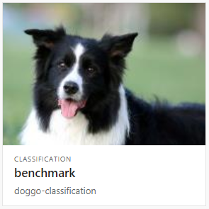
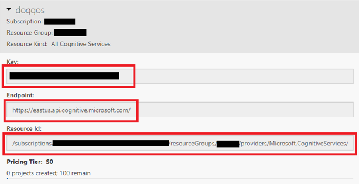
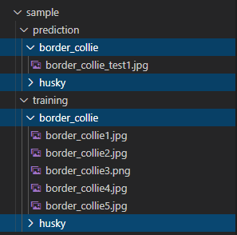
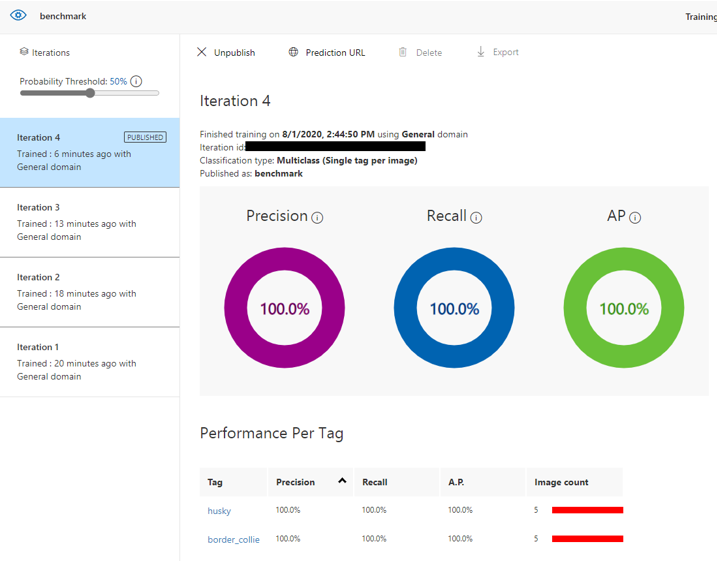

# Azure Custom Vision Benchmark

Automated programs for training and prediction tasks using Azure Custom Vision (Cognitive Services).



## Infrastructure

Create the Cognitive Services resource:

```sh
az cognitiveservices account create -n '<name>' -g '<group>' --kind CognitiveServices --sku S0 -l 'eastus2' --yes
```

For Cognitive Services --sku F0 tier is no longer available.

## Project Setup

Start by copying the sample `.env`:

```sh
cp example.env .env
```

Go to [customvision.ai](https://www.customvision.ai/projects#/settings) resources and copy the folling parameters:



💡 I've opened [#14595](https://github.com/Azure/azure-cli/issues/14595) to get the API Key using the CLI.


Now add the values to the `.env` file:

```sh
customVisionTrainingKey='<training_key>'
customVisionTrainingEndPoint='<endpoint>'
predictionResourceId='<prediction_resource_id>'
```

ℹ️ _Custom Vision recommends at least 50 images per set to ensure model performance. 
Following the rule of thumb 70/30 you should have at least 15 additional images for the prediction tests._

Set the remaining configuration for your project:

```sh
# Project
projectName='<your_project_name>'
publishName='<publish_name>'

# Sample data
trainingSampleDataRoot='<path>'
predictionSampleDataRoot='<path>'

# Tags separated by commas
tags='tag1,tag2,tag3'
```

The `tags` must match the directories for each image set.

Example:



Your data sample must match this directory structure.

## Training and Prediction

If you haven't already, download the dependencies:

```sh
yarn install
```

First you need to create your project and tags:

```sh
# This will output the project id
ts-node src/createProject.ts
```

Add the project ID to the `.env` file:

```sh
projectId='xxxxxxxx-xxxx-xxxx-xxxx-xxxxxxxxxxxx'
```

Run the model scripts:

```sh
# Upload the images
ts-node src/upload.ts

# Train the model
ts-node src/training.ts

# Run the prediction tests
ts-node src/prediction.ts
```

_My upload algorithm is limited to send a single batch of 64 images. Help me with a pull request_ 😁


ℹ️ You must unpublish previous iterations on the Performance tab at [customvision.ai](https://www.customvision.ai) if you wish to publish new ones.

You'll get an output for each image according to it's associated tag:

```
Results for [husky]:
         husky: 100.00%
         border_collie: 0.00%
Results for [border_collie]:
         border_collie: 100.00%
         husky: 0.00%
```

You may go to the portal now and see the results:



## References

[Custom Vision with SDK](https://docs.microsoft.com/en-us/azure/cognitive-services/custom-vision-service/quickstarts/image-classification?pivots=programming-language-javascript)

[Custom Vision Service Limits and Quotas](https://docs.microsoft.com/en-us/azure/cognitive-services/custom-vision-service/limits-and-quotas)
